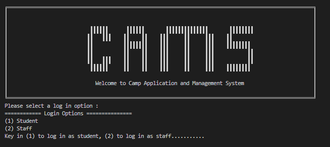

# CAMS - Camp Application and Management System

  

## About This Project ##

The goal of this project is to develop a command line interface application using Java as an Object Orientated Programming Language.

## Contributors ##
| Name              |              
|---|
|Beh Jia Jiunn |
|Hang Hao Kuang |   
|Arif Yusaf Ansari |  
|Gu ShuCheng|

