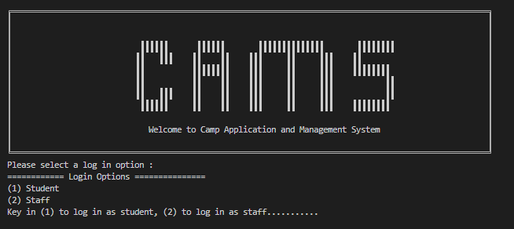

# CAMS - Camp Application and Management System

  

## About This Project ##

The goal of this project is to develop a command line interface application using Java as an Object Orientated Programming Language.

This project was developed and tested using Eclipse IDE, JAVA-19. 

Diagrams Folder - Contains the UML Class diagram, Architecture Diagram, State Machine Diagram
src - contains the source code
doc - javadoc

To run the application, go to src->camsApp-> CAMsApp and run as 1 java application.

## Contributors ##
| Name |              
|---|
|Beh Jia Jiunn |
|Hang Hao Kuang |   
|Arif Yusaf Ansari |  
|Gu ShuCheng|

